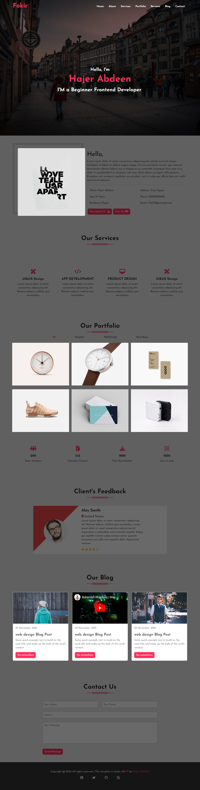
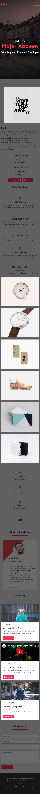

# Fokir-website

## Table of contents

- [Overview](#overview)
  - [Screenshot](#screenshot)
  - [Links](#links)
- [My process](#my-process)
  - [Built with](#built-with)
  - [What I learned](#what-i-learned)
  - [Useful resources](#useful-resources)
- [Author](#author)

## Overview
this website shows Fokir  Tempelte that give us example of Portfolio .
it designed for mobile and desktop

### Screenshot

### Links

- Solution URL: [https://github.com/Hajerabdeen/Fokir-website]
- Live Site URL: [https://hajerabdeen.github.io/Fokir-website/]

## My process

### Built with

- Semantic HTML5 markup
- CSS custom properties
- Bootstrap

### What I learned

I learn how to make a website with HTML & CSS and Bootstap ,style the elements , how to position the elements and how to make the website responsive. 

### Useful resources

- [resource 1](https://fontawesome.com) - This helped me for putting icons reason. I really liked this pattern and will use it going forward.
- [resource 2](https://fonts.google.com/specimen/Bai+Jamjuree) - This is an amazing website which helped me for styling the website font.

## Author
- Frontend Mentor - [@Hajerabdeen](https://www.frontendmentor.io/profile/Hajerabdeen)